# Fluxos

### 1. 🤝 Inicialização e Handshake

```mermaid
sequenceDiagram
    participant Dev as Desenvolvedor (Terminal)
    participant Exec as Executor (Local)
    participant Backend as Backend (Remoto)
    participant Redis as Redis

    Note over Dev: $ codegen "crie um endpoint"
    Dev->>Exec: Executa CLI local
    Note over Exec: Executor INICIA conexão ⬆️
    Exec->>Backend: WebSocket Connect (wss://backend/ws/tasks/123)
    Backend->>Exec: Connection Accepted ✅
    Exec->>Backend: Handshake (tools disponíveis + context)
    Backend->>Backend: Valida tools e cria Toolbelt
    Backend->>Redis: Salva handshake payload
    Backend->>Exec: Handshake OK, pronto para receber comandos
```




**Nota:** O **Executor** (cliente) é quem **inicia** a conexão, não o Backend.

### 2. 🚀 Bootstrap e Context Loading

```mermaid
sequenceDiagram
    participant Backend as Backend (Cérebro)
    participant Exec as Executor (Mãos)
    participant FS as File System (Local)

    Note over Backend: Backend ENVIA comandos ⬇️
    Backend->>Exec: run_tool(GetWorkingDirectory)
    Note over Exec: Executor EXECUTA localmente
    Exec->>FS: pwd (comando local)
    FS->>Exec: /home/user/project
    Note over Exec: Executor RETORNA resultado ⬆️
    Exec->>Backend: tool_result(success, "/home/user/project")
  
    Backend->>Exec: run_tool(ReadFolder, ".")
    Exec->>FS: ls -la (comando local)
    FS->>Exec: [lista de arquivos]
    Exec->>Backend: tool_result(success, files)
  
    Backend->>Backend: Constrói BootstrapContext
    Backend->>Exec: bootstrap_finished
```



**Nota:** O Backend **nunca acessa** o filesystem diretamente. Ele **pede** ao Executor.

### 3. 🔄 Task Execution Loop

```mermaid
sequenceDiagram
    participant Backend as Backend (Maestro)
    participant LLM as LLM Client
    participant Exec as Executor (Local)
    participant Redis as Redis

    Backend->>LLM: Gerar resposta + tools necessárias
    LLM->>Backend: "Preciso ler o arquivo main.py"
    Note over Backend: Backend ORQUESTRA ⬇️
    Backend->>Exec: run_tool(ReadFile, "main.py")
    Note over Exec: Executor EXECUTA
    Exec->>Exec: fs.readFileSync("main.py")
    Note over Exec: Executor RETORNA ⬆️
    Exec->>Backend: tool_result(success, file_content)
    Backend->>LLM: Continua com contexto do arquivo
    LLM->>Backend: "Vou criar o endpoint..."
    Backend->>Redis: Publica log de streaming
    Backend->>Exec: agent_message_delta (progresso)
```



**Nota:** O Backend é o **cérebro** (decide), o Executor são as **mãos** (executa).

### 4. 🔧 Tool Call Flow

```python
# Backend (Maestro): Decide executar tool e ENVIA comando ⬇️
await self.communicator.send_message("run_tool", {
    "tool_name": "Shell",
    "tool_id": str(uuid.uuid4()),
    "generation_id": self._current_generation_id,
    "parameters": {"command": "npm test", "dir_path": "."}
})
```

```typescript
// Executor (Local): RECEBE comando, EXECUTA localmente
const result = await this.tools.Shell.execute({
    command: "npm test",
    dir_path: "."
});

// Executor: RETORNA resultado ⬆️
await this.websocket.send({
    type: "tool_result",
    payload: {
        tool_id: "uuid-123",
        status: result.success ? "success" : "error", 
        result: result.stdout,
        error: result.stderr
    }
});
```

**Fluxo:**

1. Backend **decide** qual tool usar (via LLM)
2. Backend **envia** comando para Executor
3. Executor **executa** localmente (Shell, ReadFile, etc.)
4. Executor **retorna** resultado para Backend
5. Backend **valida** e decide próximo passo

### 5. ⚠️ Error Handling Flow

```typescript
// Executor: Handle WebSocket errors
this.websocket.on('error', (error) => {
    this.dispatch({ 
        type: 'CONNECTION_ERROR', 
        payload: { error: error.message }
    });
  
    // Attempt reconnection with exponential backoff
    this.reconnectWithBackoff();
});

// Backend: Handle tool execution errors  
if tool_result.status == "error":
    self.history.append(UniversalMessage(
        role="tool",
        content={
            "tool_call_id": tool_call.id,
            "name": tool_call.name, 
            "response": {"error": tool_result.error}
        }
    ))
```