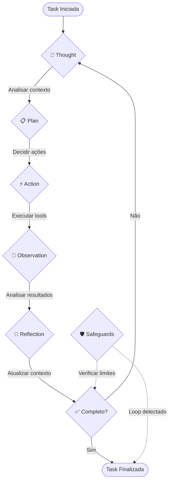

# Agent (Maestro)

### 🎯 O que é o Maestro?

O **Maestro** é o **agente autônomo central** do CodeGen. Ele implementa um loop de raciocínio inspirado no padrão **ReAct** (Reason + Act):

**Thought** → **Plan** → **Action** → **Observation** → **Reflection**

```python
class Maestro:
    """
    Agente orquestrador principal.
    Implementa o loop ReAct para resolução de problemas.
    """
  
    def __init__(
        self, 
        llm_client: OpenAIClient,
        executor_comm: ExecutorCommunicator,
        toolbelt: Toolbelt,
        safeguards: Safeguards
    ):
        self.llm_client = llm_client
        self.executor_comm = executor_comm  
        self.toolbelt = toolbelt
        self.safeguards = safeguards
        self.history: List[UniversalMessage] = []
  
    async def execute_task(self, task: TaskDTO) -> TaskResult:
        """
        Loop principal de execução da task.
        """
        context = await self._build_initial_context(task)
      
        while not self._is_task_complete(context):
            # 1. Thought: Analisar situação atual
            thought = await self._generate_thought(context)
          
            # 2. Plan: Decidir próximas ações
            plan = await self._generate_plan(thought, context)
          
            # 3. Action: Executar tools
            actions = await self._execute_actions(plan)
          
            # 4. Observation: Analisar resultados
            observation = self._analyze_results(actions)
          
            # 5. Reflection: Atualizar contexto
            context = self._update_context(context, observation)
          
            # Safeguards: Verificar loops/limites
            if self.safeguards.should_stop(context):
                break
      
        return self._finalize_task(context)
```

### 🔄 Loop ReAct Detalhado



### 🧠 Capacidades do Maestro

| Capacidade                | Descrição                                  | Implementação             |
| ------------------------- | -------------------------------------------- | --------------------------- |
| **🎯 Planejamento** | Divide tasks complexas em subtasks           | Chain-of-Thought prompting  |
| **🔧 Execução**   | Orquestra tools do Executor via WebSocket    | ExecutorCommunicator        |
| **📊 Observação** | Analisa resultados e decide próximos passos | Result parsing + validation |
| **🧠 Memória**     | Mantém contexto histórico da conversa      | History management          |
| **🛡️ Proteção** | Detecta loops e limita recursos              | Safeguards integration      |
| **🔄 Adaptação**  | Ajusta estratégia com base em feedback      | Dynamic prompting           |

### 💭 Prompts do Maestro

```python
# Sistema de prompts estruturados
MAESTRO_SYSTEM_PROMPT = """
Você é o Maestro, um assistente de desenvolvimento de software.

SUAS CAPACIDADES:
- Analisar código e estruturas de projeto
- Gerar e modificar arquivos
- Executar comandos e testes
- Resolver problemas de forma iterativa

FERRAMENTAS DISPONÍVEIS:
{available_tools}

PROCESSO DE TRABALHO:
1. THOUGHT: Analise a situação atual
2. PLAN: Decida as próximas ações
3. ACTION: Execute as ferramentas necessárias  
4. OBSERVATION: Analise os resultados
5. REFLECTION: Atualize seu entendimento

REGRAS:
- Sempre explique seu raciocínio
- Teste suas mudanças antes de finalizar
- Peça confirmação para ações destrutivas
- Mantenha o código limpo e documentado
"""

THOUGHT_PROMPT = """
Situação atual: {current_situation}
Histórico: {history}

THOUGHT: Analise a situação e explique seu raciocínio.
"""

PLAN_PROMPT = """
Thought: {thought}
Contexto: {context}

PLAN: Quais ferramentas você usará e em que ordem?
"""
```