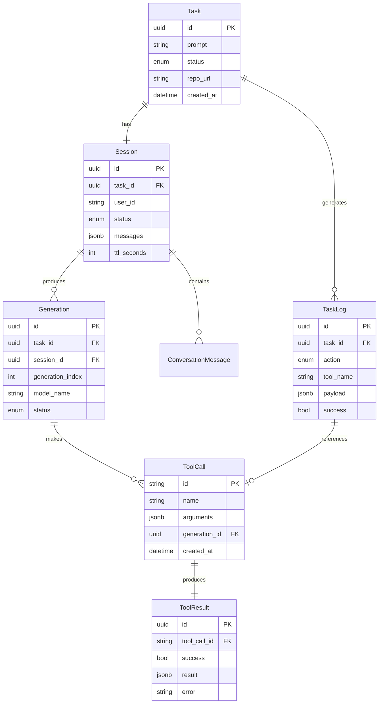

# Relacionamentos entre Conceitos



### 🔗 Navegação entre Conceitos

```python
# Dado uma Task, encontrar todos os logs
async def get_task_audit_trail(task_id: uuid.UUID) -> List[TaskLogDTO]:
    """Recupera trilha completa de auditoria de uma task."""
    return await task_log_repository.find_by_task_id(task_id)

# Dado uma Session, calcular custo total
async def calculate_session_cost(session_id: uuid.UUID) -> float:
    """Calcula custo total das chamadas LLM de uma sessão."""
    generations = await generation_repository.find_by_session_id(session_id)
    return sum(gen.token_usage.cost_estimate for gen in generations)

# Dado um ToolCall, recuperar contexto completo
async def get_tool_call_context(tool_call_id: str) -> ToolCallContext:
    """Recupera contexto completo de uma chamada de tool."""
    tool_call = await tool_call_repository.find_by_id(tool_call_id)
    tool_result = await tool_result_repository.find_by_tool_call_id(tool_call_id)
    generation = await generation_repository.find_by_id(tool_call.generation_id)
    task = await task_repository.find_by_id(generation.task_id)
  
    return ToolCallContext(
        tool_call=tool_call,
        tool_result=tool_result, 
        generation=generation,
        task=task
    )
```

:::tip Próximas Seções

- 🔌 **[API Reference](../api/endpoints.md)** - Documentação completa dos endpoints
- ⚙️ **[Configuração](../configuration/environment.md)** - Variáveis de ambiente e setup
- 🔍 **[Observabilidade](../observability/logging.md)** - Logs, métricas e debugging
  :::

:::info Conceitos Avançados
Para entender padrões avançados como **Multi-Agent Systems** e **Long-Term Memory**, consulte a documentação de [Extensibilidade](../extensibility/custom-agents.md).
:::

:::warning Evolução dos Schemas
Os modelos de dados estão em **evolução ativa**. Consulte sempre o código-fonte para schemas atualizados:

- **Backend Models:** `app/models/`
- **DTOs:** `app/schemas/`
- **Database Migrations:** `migrations/`
  :::