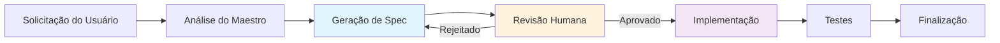

# Spec-Driven Development

### 🎯 O que é Spec-Driven?

O **Spec-Driven Development** é uma abordagem onde mudanças complexas são **guiadas por especificações** detalhadas antes da implementação.



### 📋 Estrutura de uma Spec

```yaml
# CODEGEN.md - Especificação do projeto
spec_version: "1.0"
project_name: "API de E-commerce"
description: "API REST para sistema de e-commerce"

architecture:
  pattern: "Clean Architecture"
  layers:
    - presentation
    - business
    - data
  
technologies:
  backend: "FastAPI + SQLAlchemy"
  database: "PostgreSQL"
  cache: "Redis"
  
endpoints:
  - path: "/api/users"
    methods: ["GET", "POST"]
    authentication: "required"
  
  - path: "/api/products"
    methods: ["GET", "POST", "PUT", "DELETE"]  
    authentication: "admin_only"

database:
  tables:
    - name: "users"
      fields:
        - {name: "id", type: "UUID", primary_key: true}
        - {name: "email", type: "VARCHAR(255)", unique: true}
        - {name: "created_at", type: "TIMESTAMP"}
      
    - name: "products"
      fields:
        - {name: "id", type: "UUID", primary_key: true}
        - {name: "name", type: "VARCHAR(100)"}
        - {name: "price", type: "DECIMAL(10,2)"}

tests:
  coverage_minimum: 80
  types: ["unit", "integration", "e2e"]
  
deployment:
  environment: "docker"
  ci_cd: "GitHub Actions"
```

### 🔄 Fluxo Spec-Driven

```python
class SpecDrivenWorkflow:
    """
    Workflow orientado a especificações.
    """
  
    async def process_complex_request(self, request: str) -> TaskResult:
        # 1. Analisar complexidade da solicitação
        complexity = await self._analyze_complexity(request)
      
        if complexity.is_complex:
            # 2. Gerar especificação detalhada
            spec = await self._generate_spec(request)
          
            # 3. Solicitar aprovação humana
            approval = await self._request_human_approval(spec)
          
            if not approval.approved:
                return self._handle_rejection(approval.feedback)
          
            # 4. Implementar baseado na spec
            return await self._implement_from_spec(spec)
        else:
            # Implementação direta para requests simples
            return await self._direct_implementation(request)
  
    async def _generate_spec(self, request: str) -> ProjectSpec:
        """Gera especificação detalhada."""
        prompt = f"""
        Analise esta solicitação e gere uma especificação técnica detalhada:
      
        SOLICITAÇÃO: {request}
      
        GERE UMA SPEC INCLUINDO:
        - Arquitetura proposta
        - Tecnologias a serem usadas  
        - Estrutura de arquivos
        - Endpoints (se aplicável)
        - Schema de banco (se aplicável)
        - Estratégia de testes
        - Plano de implementação passo-a-passo
        """
      
        return await self.llm_client.generate_spec(prompt)
```

### 💡 Vantagens do Spec-Driven

| Vantagem                     | Descrição                                    | Benefício              |
| ---------------------------- | ---------------------------------------------- | ----------------------- |
| **🎯 Clareza**         | Especificação clara antes da implementação | Reduz retrabalho        |
| **👥 Colaboração**   | Humanos podem revisar e ajustar specs          | Melhor alinhamento      |
| **📊 Rastreabilidade** | Histórico completo de decisões               | Facilita manutenção   |
| **🔄 Iteração**      | Specs podem ser refinadas antes do código     | Menor custo de mudança |
| **🧪 Testabilidade**   | Critérios de aceite claros desde o início    | Testes mais eficazes    |

---