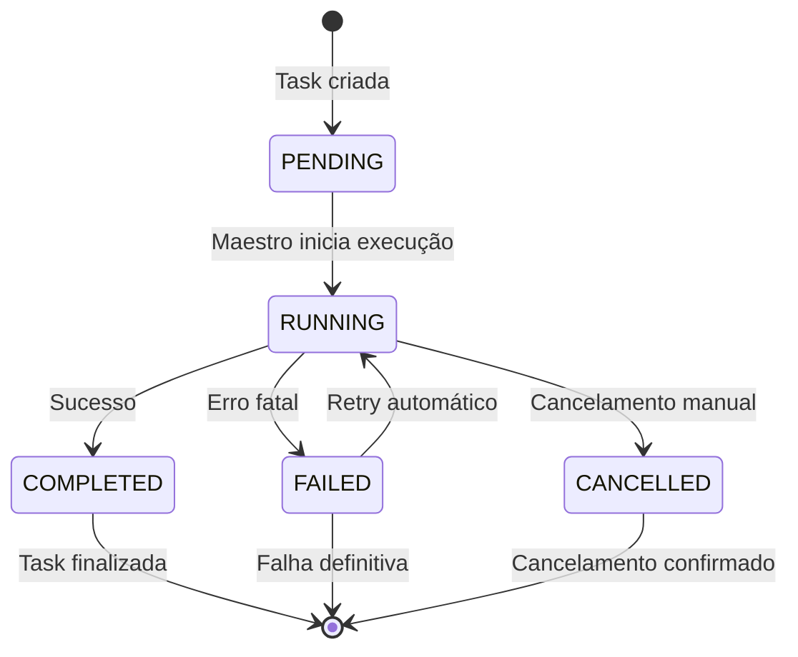

# Task (Tarefa)

### O que é uma Task?

Uma **Task** é a **unidade atômica de trabalho** no CodeGen. Representa um objetivo específico do desenvolvedor que será executado pelo sistema.

```python
# Modelo de dados da Task
class TaskDTO(BaseModel):
    id: uuid.UUID                    # Identificador único
    prompt: str                      # Objetivo do usuário
    status: TaskStatus               # Estado atual
    repo_url: str | None             # Repositório (opcional)
    created_at: datetime
    updated_at: datetime

class TaskStatus(str, Enum):
    PENDING = "pending"              # Aguardando execução
    RUNNING = "running"              # Em execução
    COMPLETED = "completed"          # Finalizada com sucesso
    FAILED = "failed"                # Finalizada com erro
    CANCELLED = "cancelled"          # Cancelada pelo usuário
```

### Estados de uma Task



### Ciclo de Vida de uma Task

| Estado              | Descrição                               | Próximos Estados                        | Ações Possíveis |
| ------------------- | ----------------------------------------- | ---------------------------------------- | --------------- |
| **PENDING**   | Task foi criada, aguardando processamento | `RUNNING`                              | Iniciar execução |
| **RUNNING**   | Maestro está executando a task           | `COMPLETED`, `FAILED`, `CANCELLED` |  Pausar, Cancelar |
| **COMPLETED** | Task finalizada com sucesso               | -                                        | Ver logs, Clonar |
| **FAILED**    | Falha na execução                       | `RUNNING`                              | Retry, Debug |
| **CANCELLED** | Cancelada pelo usuário                   | -                                        | Ver logs      |

### Exemplos de Tasks

```python
# Task simples - Criar arquivo
task_1 = TaskDTO(
    prompt="Crie um arquivo README.md com instruções de instalação",
    repo_url="https://github.com/user/projeto"
)

# Task complexa - Refatoração
task_2 = TaskDTO(
    prompt="Refatore a classe UserService para usar async/await e adicione testes unitários",
    repo_url="https://github.com/user/api-backend"
)

# Task de debugging
task_3 = TaskDTO(
    prompt="Os testes estão falhando no CI, investigue e corrija os problemas",
    repo_url=None  # Pode usar repositório local
)
```

---