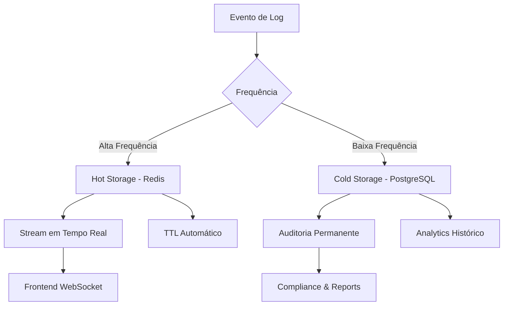

# Observabilidade e Debug

## Visão Geral

O **CodeGen** implementa um sistema robusto de **observabilidade** que permite monitoramento em tempo real, debugging eficaz e análise de performance. O sistema é projetado para fornecer **visibilidade completa** do comportamento interno, desde interações do usuário até execuções de LLM.

### Componentes de Observabilidade

- **Logs Estruturados** - Sistema dual (Hot/Cold Storage)
- **Health Checks** - Monitoramento de saúde dos serviços
- **Métricas** - Coleta automática via Prometheus
- **Distributed Tracing** - Rastreamento end-to-end
- **Alertas** - Notificações proativas de problemas
- **Debugging Tools** - Ferramentas especializadas para troubleshooting

:::info Filosofia de Observabilidade
O CodeGen segue os **três pilares da observabilidade**:

- **Logs** - O que aconteceu?
- **Métricas** - Como está a performance?
- **Traces** - Como o sistema se comporta end-to-end?
  :::

---

## Sistema de Logs Dual Storage

### Arquitetura Hot vs Cold Storage

O CodeGen implementa um **padrão inovador de logs duplos** que otimiza tanto a **experiência do usuário** quanto a **auditoria de longo prazo**:



### Hot Storage (Redis)

**Propósito:** Logs de **alta frequência** para experiência de usuário em **tempo real**.

| Característica         | Valor                             |
| ----------------------- | --------------------------------- |
| **Armazenamento** | Redis Streams                     |
| **TTL**           | 24 horas (configurável)          |
| **Uso**           | UI em tempo real, debugging ativo |
| **Performance**   | < 1ms latência                   |

**Tipos de logs em Hot Storage:**

```python
# Logs para Hot Storage (Redis)
HOT_STORAGE_LOG_TYPES = [
    "thought",           # Pensamentos intermediários do LLM
    "stream_delta",      # Deltas de streaming (tokens)
    "tool_progress",     # Progress de execução de tools
    "websocket_message", # Mensagens WebSocket
    "user_interaction",  # Interações do usuário
    "llm_request",       # Requests para LLM (sem response)
    "executor_heartbeat" # Heartbeats do Executor
]
```
### Cold Storage (PostgreSQL)

**Propósito:** Logs **consolidados** para auditoria permanente e análise histórica.

| Característica         | Valor                                   |
| ----------------------- | --------------------------------------- |
| **Armazenamento** | PostgreSQL (TaskLog table)              |
| **Retenção**    | Permanente (ou política de retenção) |
| **Uso**           | Auditoria, compliance, analytics        |
| **Performance**   | Otimizado para queries analíticas      |

**Tipos de logs em Cold Storage:**

```python
# Logs para Cold Storage (PostgreSQL)
COLD_STORAGE_LOG_TYPES = [
    "task_created",      # Task criada
    "task_completed",    # Task finalizada
    "task_failed",       # Task falhou
    "tool_executed",     # Tool foi executada
    "llm_completion",    # Response completo do LLM
    "user_approval",     # Aprovação/rejeição do usuário
    "error_occurred",    # Erros críticos
    "security_event",    # Eventos de segurança
    "cost_tracking",     # Rastreamento de custos
    "performance_metric" # Métricas de performance
]
```


## Níveis de Log

### Hierarquia de Severidade

| Nível                 | Uso                                       | Exemplo                                | Ação                 |
| ---------------------- | ----------------------------------------- | -------------------------------------- | ---------------------- |
| **🐛 DEBUG**     | Desenvolvimento, debugging detalhado      | Variáveis internas, fluxo de código  | Apenas desenvolvimento |
| **ℹ️ INFO**    | Operações normais, informações gerais | Task criada, tool executada            | Log normal             |
| **⚠️ WARNING** | Situações anômalas mas não críticas  | Rate limit atingido, retry automático | Monitoramento          |
| **❌ ERROR**     | Erros que afetam operação específica   | Tool falhou, timeout de API            | Investigação         |
| **🚨 CRITICAL**  | Erros que afetam todo o sistema           | DB desconectado, API indisponível     | Alerta imediato        |

## Métricas e Monitoramento

### Métricas Coletadas Automaticamente

```python
# app/middleware/metrics_middleware.py
from prometheus_client import Counter, Histogram, Gauge
from fastapi import Request
import time

# 📊 Definir métricas
REQUEST_COUNT = Counter(
    'http_requests_total',
    'Total HTTP requests',
    ['method', 'endpoint', 'status_code']
)

REQUEST_DURATION = Histogram(
    'http_request_duration_seconds',
    'HTTP request duration',
    ['method', 'endpoint']
)

ACTIVE_TASKS = Gauge(
    'active_tasks_total',
    'Number of currently active tasks'
)

LLM_REQUESTS = Counter(
    'llm_requests_total',
    'Total LLM requests',
    ['model', 'provider', 'status']
)

LLM_TOKENS = Counter(
    'llm_tokens_total',
    'Total LLM tokens consumed',
    ['model', 'type']  # type: prompt, completion
)

LLM_COST = Counter(
    'llm_cost_usd_total', 
    'Total LLM cost in USD',
    ['model', 'provider']
)

TOOL_EXECUTIONS = Counter(
    'tool_executions_total',
    'Total tool executions',
    ['tool_name', 'status']
)

WEBSOCKET_CONNECTIONS = Gauge(
    'websocket_connections_active',
    'Active WebSocket connections'
)

```

